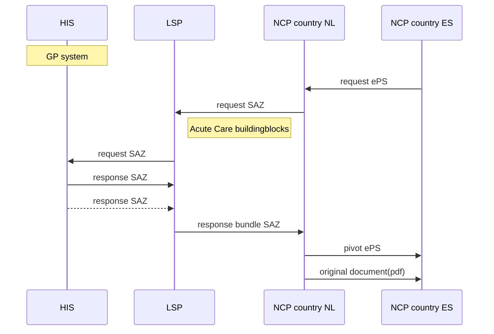
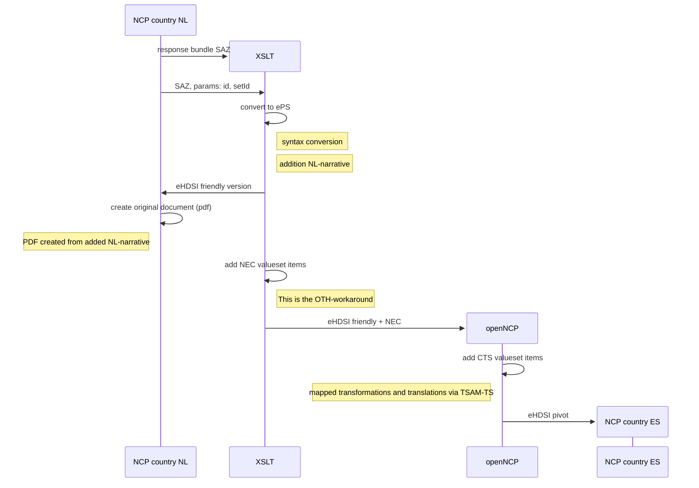

# Conversion specifications

This is the entrance to the conversion specifications: [acute zorg naar ePS](converter/eps.md).

# PIEZO-A Netherlands sequence diagram

# XSLT and openNCP transformations

* CIBG stuurt een generieke query naar LSP met contextcode,
* b.v. PS-MKA, PS-AMB etc.(volgens mij wordt dat een eigen code en geen hergebruik van NL codes. In toekomst straks uitbreiding van bronnen)
* PS-AMB en PS-SEH zijn (nu) hetzelfde
* contextcode die CIBG gebruikt weet Camille niet
>PS-AK9: Voor het opvragen van patiëntgegevens bij huisartssystemen zal een nieuwe LSP-zorgtoepassing gedefinieerd worden op basis van de informatiestandaard voor acute zorg, gebruikmakend >van de bestaande HL7 CDA bouwstenen van ketenzorg en acute zorg. [AK:4]
* LSP checkt wat erin zit (bouwstenen), checkt wie wat aangemeld heeft, zet queries uit, LSP bundelt respons in batchantwoord
* daarin zitten ketenzorg bouwstenen
* bron van deze bouwstenen zijn nu allen HISsen, geen AISen of andere XISen,
* kunnen meerdere huisartsen zijn, meestal 1, in sommige gevallen zijn het er meer (ouderen, psych.). Moet de praktijk uitwijzen. Dit valt of staat met het juist 'afmelden' van patienten wanneer patient verhuist en naar een nieuwe huisarts gaat. Denk liever aan studenten ipv ouderen in ePS context. 

# Versies ART-DECOR

versie: acutezorg 2.1.0 https://decor.nictiz.nl/ad/#/acutezorg-/project/publication

* kezo bouwstenen veranderen niet naar 2.2.0
* templates acutezorg: dat zijn de kezo bouwstenen, hoogste niveau is de organizer
* deze lijst: https://decor.nictiz.nl/pub/acutezorg/acutezorg-html-20210122T101324/rules.html
* publicaties kentenzorg (voor acute zorg): https://decor.nictiz.nl/ad/#/az-vzvz-/project/publication
* samenvatting SEH: https://decor.nictiz.nl/pub/vzvz/az-vzvz-html-20230717T130020/tmp-2.16.840.1.113883.2.4.3.111.3.21.10.3-2020-06-04T135255.html
* batch wrapper LSP is MCCI**, daaronder REPC** etc.
* batch wrappers zitten in "acute zorg op het LSP", versie 1.4? navragen Dennis
* Dennis van Leeuwen is de architect bij VZVZ
* ze gebruiken geen ADA maar maken de voorbeelden in XML
* acutezorg  2.1.0 zit ook in kwalificatie.nictiz.nl

# ePS

* Europese project zit hier: https://art-decor.ehdsi.eu/art-decor/decor-project--epsos-
  * AD3 version: https://art-decor.ehdsi.eu/ad/#/home
* Hier zit v 8.0.0 van de ePS, waarschijnlijk is dit de juiste: https://art-decor.ehdsi.eu/publication/
* ePS dataset document: https://health.ec.europa.eu/document/download/e020f311-c35b-45ae-ba3d-03212b57fa65_en?filename=ehn_guidelines_patientsummary_en.pdf

# NCPeh NL

<https://www.ncpeh.nl/>

# Other relevant documentation

[CDA specification HL7]([https://www.hl7.org/documentcenter/private/standards/v3/edition_web/infrastructure/cda/cda.html](https://hl7.org/cda/))
