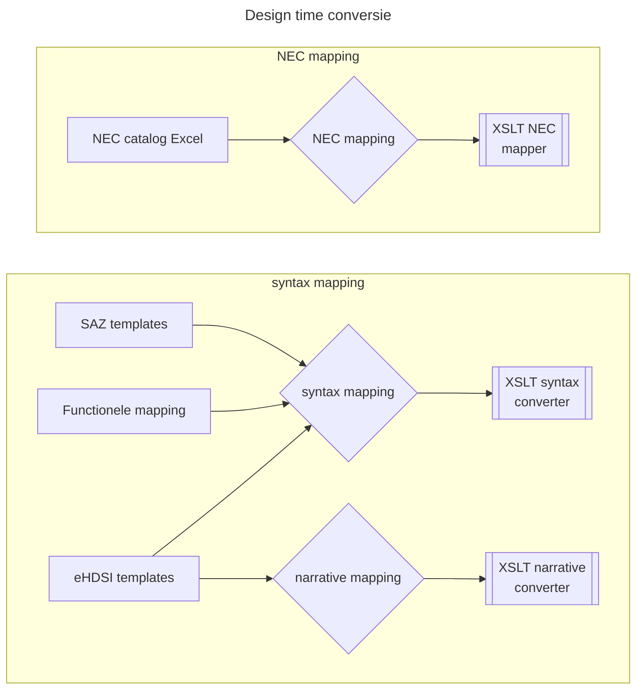
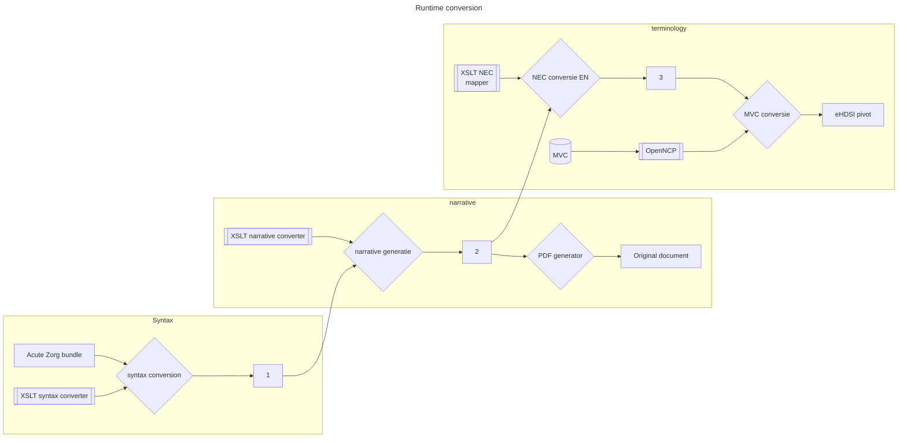

# NL Acute zorg to ePS conversions

## Conversion specifications

### Terminology mapping file

This code needs the latest mapping.xml from https://github.com/Nictiz/ncp-terminologie

### Conversion of acute zorg to eHDSI format

These markdown files describe in readable language the conversion of "acute zorg" (emergency care) patient summary to the European Patient Summary in eHDSI format.

Target: [Template  eHDSI Patient Summary](https://art-decor.ehdsi.eu/publication/epsos-html-20240422T073854/tmp-1.3.6.1.4.1.12559.11.10.1.3.1.1.3-2024-04-19T100332.html)

Source: the source is a batch of CDA clinical statements, part of Acute zorg. there is no real document-style input

The conversion has several steps:

1. The main converter which translates acute zorg batch to ePS: [az2eps.xsl](az2eps.xsl)
1. The narrative generator which adds narratives to the ePS: [narrative.xsl](narrative.xsl)
1. Terminology mapping with [terminology_mapping.xsl](terminology_mapping.xsl).

These should be run in order. The narrative generator can also be run after terminology translation. When run before, it will add a mostly Dutch narrative. The main converter (az2eps) accepts some parameters:

- documentIdRoot: OID root for the ClinicalDocument
- documentSetIdRoot: OID root for set id for the ClinicalDocument (should be the same for pivot and originalDocument)
- documentId: id for the ClinicalDocument
- documentSetId: set id for the ClinicalDocument (should be the same for pivot and originalDocument)
- targetLanguage: for headers and codes
- genSchemaRefs: generates schemalocation and schematron PS, not allowed in productiom, default: false

Terminology mapping accepts one parameter:

- doCts: if true, will apply CTS code conversions, default: false

The XSLT files will be stored adjacent to the specs in markdown.

The default layout:
  - ncp-conversie (https://github.com/Duometis/ncp-conversie)
    - converter: the XSLT's used for transformation
    - pivot-examples: examples of eHDSI PS, not needed runtime
      (from: https://code.europa.eu/ehdsi/ehdsi-general-repository/-/tree/main/cda%20documents/W7/PS)
    - hl7: Nictiz repo with utilities (will be moved to adjacent folder later)
    - in: input for the converter,test files
    - out: generated ePS, with {input-filename}-pivot.xml output, w/o NEC/OTH solution
    - out-nec: generated ePS, with {input-filename}-pivot.xml output, with NEC/OTH solution
    - out-html: examples HTML output for pivot using standard CDA stylesheet
    - out-transcoded: examples HTML output for pivot using eHDSI CDA display tool which translates content
    - TM-resources: CDA pharm schema from Transformation Manager(other files are not needed)
    - TM-transform: eHDSI CDA display tool from Transformation Manager

TM-resources and TM-transform content needs to be supplied by CIBG from the Transformation Manager sources.

### HTML transformation

Regular HTML transformation can be done with:
  - CDA-core-2.0 (https://github.com/HL7/CDA-core-2.0)

## Validation

### Acute zorg batch

The acute zorg batch files can be validated using the appropriate schematrons from:
- https://decor.nictiz.nl/ad/#/acutezorg-/project/publication
- https://decor.nictiz.nl/ad/#/az-vzvz-/project/publication

Currently used versions:
- [Acute Zorg op het LSP versie 1.2](https://decor.nictiz.nl/pub/vzvz/az-vzvz-xml-20210308T112546.zip)
- [V2.1.0, Professionele samenvatting van HA naar AMB, SEH, MKA;](https://decor.nictiz.nl/pub/acutezorg/acutezorg-xml-20210122T101324.zip)

Store the extracted zips in some adjacent folder and validate using:
- from  in the first zip
  - az-vzvz-opleverenPSSEH.sch
- from the second zip:
  - acutezorg-beschikbaarstellenAlerts.sch
  - acutezorg-beschikbaarstellenAllergieintoleranties.sch
  - acutezorg-beschikbaarstellenEpisodes.sch
  - acutezorg-beschikbaarstellenMedicatieafspraken.sch
  - (those are the currently relevant ones for NCP, maybe additional ones are needed later.)

### eHDSI pivot format

Get the schematrons from:
- https://art-decor.ehdsi.eu/publication/

Use 'eHDSI Patient Summary' with the appropriate wave number.
Currently used: 8.1.0

Gazelle validation can be done at: https://gazelle.ehdsi.eu/evs/home.seam

TM_recources contains an eHDSI schema with the IHE pharm namespaces included, best is to use CDA_Pharma.xsd for schema validation.

## eHDSI sections

Description of eHDSI sections with source and target templates and details

### epSOS datatypes

Many datatypes from epSOS differ from the acute zorg datatypes, see: [epSOS datatypes](datatypes-epsos.md)

The following eHDSI sections are available. 
Not all are supported by the acute zorg PS, but if not, that is indicated in the section.

### eHDSI A.1 Patient summary Header data elements

**Target**: [Template  eHDSI Patient Summary](https://art-decor.ehdsi.eu/publication/epsos-html-20240422T073854/tmp-1.3.6.1.4.1.12559.11.10.1.3.1.1.3-2024-04-19T100332.html)

**Source**: the source is a batch of CDA clinical statements, there is no real document-style input

Some header fields are fixed values, those are not listed here. 

List of fields which need to be filled in the conversion which are not fixed. In *italic quotes from the ePS or acute zorg specs* and in **bold decisions for CIBG/the NCP**.

- from 2.16.840.1.113883.3.1937.777.11.10.110 [eHDSI Id (DYNAMIC)](https://art-decor.ehdsi.eu/publication/epsos-html-20240422T073854/tmp-2.16.840.1.113883.3.1937.777.11.10.110-DYNAMIC.html): 
ID a UID is needed for @root, an identifier for extension. For development and testing we will use a test OID and some extension. In production these values should be provided and logged **by the NCP** (see https://github.com/orgs/Duometis/projects/1/views/1?pane=issue&itemId=84521983&issue=Duometis%7Cncp-conversie%7C2)
- effectiveTime: probably time of generation of the ePS, maybe the timestamp of the acute zorg batch
- confidentialityCode: always use 'N' ('normal') (see: https://github.com/Duometis/ncp-conversie/issues/3)
- languageCode: for the eHDSI friendly format, 'nl-NL'
- setId: '_This identifier is used to link together different versions of the same document: the CDA L3 document, the CDA PDF embedded document and the version in the national infrastructure._' We need to decide on a value. For dev and testing, we will provide one, in production this must be supplied an logged **by the NCP** issue: https://github.com/Duometis/ncp-conversie/issues/2).

- [eHDSI A.1.1 Identification of the patient/subject](eps-patient.md)
- eHDSI A.1.2 Contact information: geen vulling
- [eHDSI A.1.2.2 Preferred HP to contact](eps-authororganization.md)
- eHDSI A.1.2.3 Contact person/legal guardian: geen vulling (geen gegevens in acute zorg batch)
- eHDSI A.1.3 Insurance information: geen vulling
- [eHDSI A.1.5 Author and Organisation](eps-authororganization.md)
- eHDSI A.1.6 Additional information / Knowledge resources: geen vulling

### eHDSI A.2 Patient summary body data elements

- eHDSI A.2.1 Alerts
  - [eHDSI A.2.1.1 Allergy](section-allergies.md)
  - [eHDSI A.2.1.2 Medical alert information](eps-alerts.md)
- eHDSI A.2.2 Medical history
  - eHDSI A.2.2.1 Vaccination/prophylaxis information: geen vulling vanuit HIS
  - [eHDSI A.2.2.2 Resolved, closed or inactive problems](section-past-illness.md)
- eHDSI A.2.3 Medical problems
  - [eHDSI A.2.3.1 Current problems](section-active-problems.md)
  - eHDSI A.2.3.2 Medical devices and implants: geen vulling vanuit HIS
  - eHDSI A.2.3.3 Procedures: geen vulling vanuit HIS
  - eHDSI A.2.3.4 Functional status: geen vulling vanuit HIS
 - Medication summary
   - [eHDSI A.2.4.1 Current and relevant past medicines](section-medicationsummary.md)
- eHDSI A.2.5 Social history: geen vulling vanuit HIS
- eHDSI A.2.6 Pregnancy history: geen vulling vanuit HIS
  - eHDSI A.2.6.1 Current pregnancy status
  - eHDSI A.2.6.2 History of previous pregnancies
- eHDSI A.2.7 Patient provided data: geen vulling vanuit HIS
  - eHDSI A.2.7.1 Travel history
  - eHDSI A.2.7.2 Advance Directives
- eHDSI A.2.8 Results
  - eHDSI A.2.8.1 Result observations: Plateau 1: geen vulling vanuit HIS
  - eHDSI A.2.8.2 Vital Signs: Plateau 1: geen vulling vanuit HIS
- eHDSI A.2.9 Plan of Care: Plateau 1: geen vulling vanuit HIS


## Terminology mapping

Terminology mapping occurs in several places:

- CTS is a part of the NCP which uses the Master Value Catalog to do code-to-code mappings. The mappings are provided by Nictiz. This is not done by the ncp-conversion software. (The ncp-conversion can do a simulated CTS mapping with de doCts flag for testing purposes, this is however not a reliable replacement of the NCP/CTS conversion and should not be used in production.)
- NEC mappings, which is done by the ncp-conversion software.
- TEXT mappings, also done by the ncp-conversion software.

The mappings are done using a mapping.xml in /terminology which is made with the ncp-terminology Github repo code, taking an Excel as input and generating a mapping.xml.

- nl_codesystem: input, to be translated
- versie_nl_codesystem
- nl_code: input, to be translated
- nl_description
- eu_concept_code: only for CTS mappings
- eu_description: only for CTS mappings
- eu_codesystem: only for CTS mappings
- versie_eu_codesystem
- nullflavour_codesystem
- nullflavour: should be 'OTH' for NEC mappings, can be ignored for CTS and Tekst
- translation_codesystem: target for NEC mappings
- translation_code: target for NEC mappings
- displayname: target for NEC mappings
- soort_mapping: CTS, NEC, Tekst
- map: the name of the Excel tab
- text: to be used for TXT mappings

The column 'soort_mapping' decides which mapping is done in ncp-conversie, CTS is skipped (unless the doCts flag for testing is used).

### NEC/OTH mappings

The GPK-ATC mapping is done in: section-medicationsummary.xsl

The ATC codes are supplied in another CDA part than the original GPK codes: therefore this is not done in the generic terminology_mapping.xsl which only changes a <code> element. The section-medicationsummary.xsl will add a generic code construct with the proper ATC code to the pivot document.

Other NEC mappings are done in terminology_mapping.xsl.

This will:
- look for elements which may be translated (all elemnts with code and codeSystem, hl7:*[@code][@codeSystem])
- look in unencoded-codesystems.xml, codes which will lead to an NCP errors for unknown codesystem, and are therefore changed to originalText
- otherwise, find the corresponding row in mapping.xml
- if soort_mapping = 'CTS', skip (unless testing with the doCts flag)
- if soort_mapping = 'NEC' and 'nullflavour' = 'OTH':
  - add OTH and codesytem
  - copy originalText if source has it
  - otherwise use displayName for originalText
  - add translation element with English text from mapping.xml translation columns

I.e. this fragment:

```xml
<value xsi:type="CD"
      code="L03"
      codeSystem="2.16.840.1.113883.2.4.4.31.1"
      displayName="Lage-rugpijn zonder uitstraling"/>
```

will be translated to this:

```xml
<value nullFlavor="OTH"
        codeSystem="2.16.840.1.113883.2.4.4.31.1"
        xsi:type="CD">
    <originalText>Lage-rugpijn zonder uitstraling</originalText>
    <translation code="L03"
                codeSystem="2.16.840.1.113883.2.4.4.31.1"
                displayName="Low back symptoms/complaints without radiaton"
                xsi:type="CD"/>
</value>
```

Existing translation elements in source will be copied as well. This may be higher-level G-standaard codes.

### NEC without OTH

Code will be copied as-is from source to target.

### Tekst mappings

TODO FROM HERE

## Versioning

For each new release of:

- https://decor.nictiz.nl/ad/#/acutezorg-/project/publication
- https://decor.nictiz.nl/ad/#/az-vzvz-/project/publication

(insofar as relevant to acute zorg SEH PS) the developers of this repository need to be notified, since changes to the content may need adaptations to the conversion.

For each eHDSI release ("Wave") there is an update needed to:

- the schematrons used for validation
- the mapping with NEC/OTH codes used in the conversion
- TM-resources (will not really change often)
- TM-transform: to update to the current CDA display tool
- possibly the conversion itself if changes need to be applied to the conversion.

## Design time flow

These XSLT's are developed design-time, based on the various specifications. These will need to be adapted after changes to the specifications of acute zorg, eHDSI format, NEC.



## Runtime flow

The above components are used runtime to convert the Dutch acute zorg PS to eHDSI pivot format.



