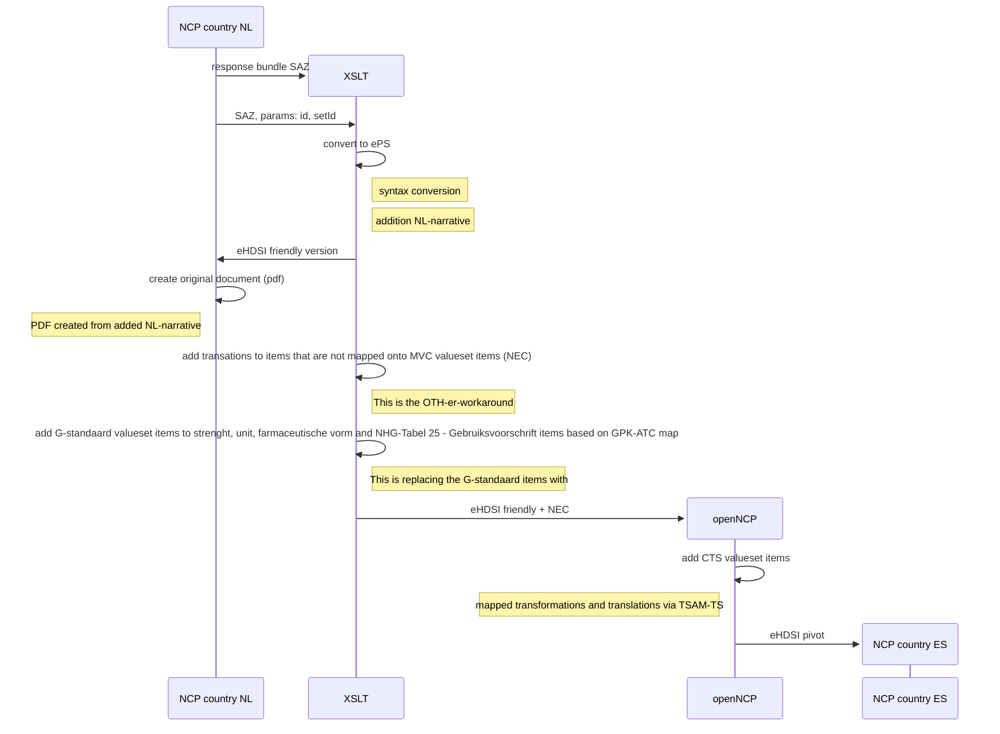

# XSLT and openNCP transformations

```mermaid
sequenceDiagram

  participant A as NCP country NL
 
create participant XSLT

 
    A->>XSLT: response bundle SAZ

    A->>XSLT: SAZ, params: id, setId
  
    XSLT->>XSLT: convert to ePS
Note right of XSLT: syntax conversion
Note right of XSLT: addition NL-narrative

    XSLT->>A: eHDSI friendly version
    A->>A: create original document (pdf)
Note left of A: PDF created from added NL-narrative
    XSLT->>XSLT: add transations to items that are not mapped onto MVC valueset items (NEC)
Note right of XSLT: This is the OTH-er-workaround
XSLT->>XSLT: add G-standaard valueset items to strenght, unit, farmaceutische vorm and NHG-Tabel 25 - Gebruiksvoorschrift items based on GPK-ATC map
Note right of XSLT: This is replacing the G-standaard items with 
  create participant openNCP
    XSLT->>openNCP: eHDSI friendly + NEC 
   openNCP->>openNCP: add CTS valueset items
Note left of openNCP: mapped transformations and translations via TSAM-TS
create participant NCP country ES
    openNCP->> NCP country ES: eHDSI pivot

```
